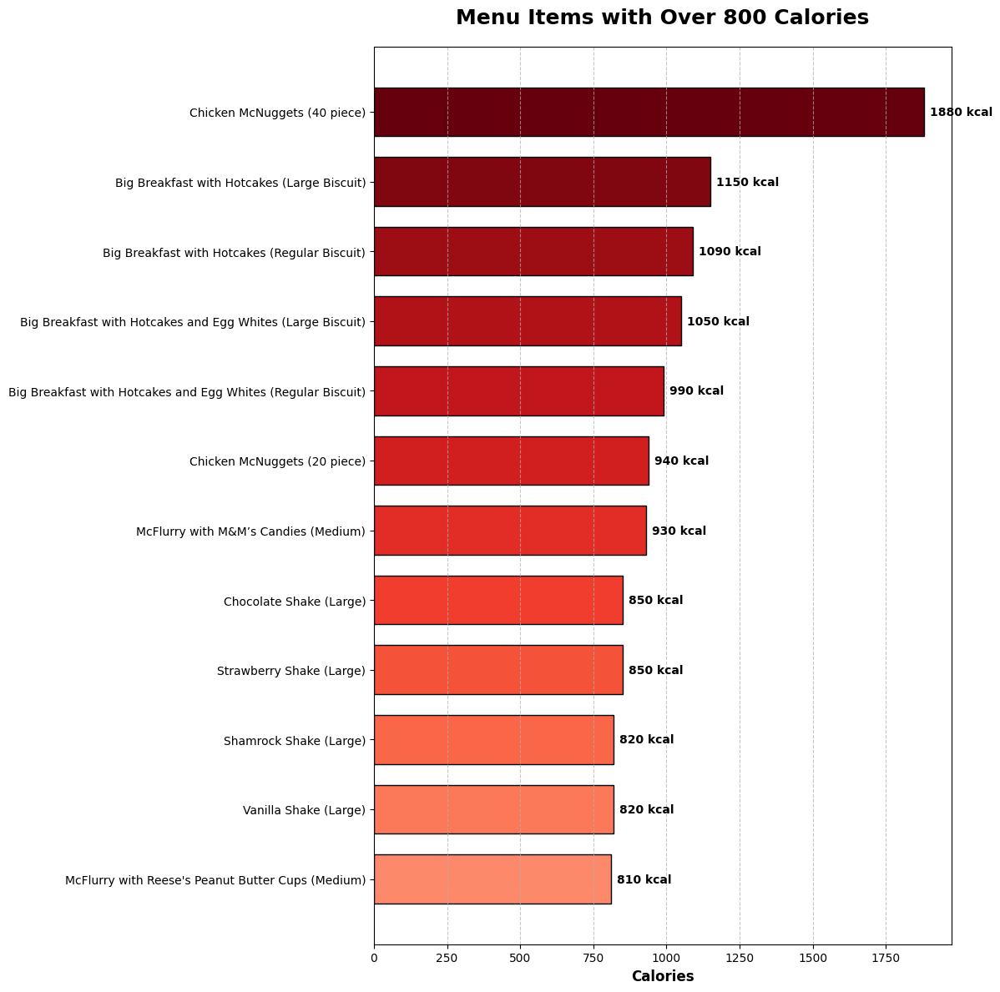
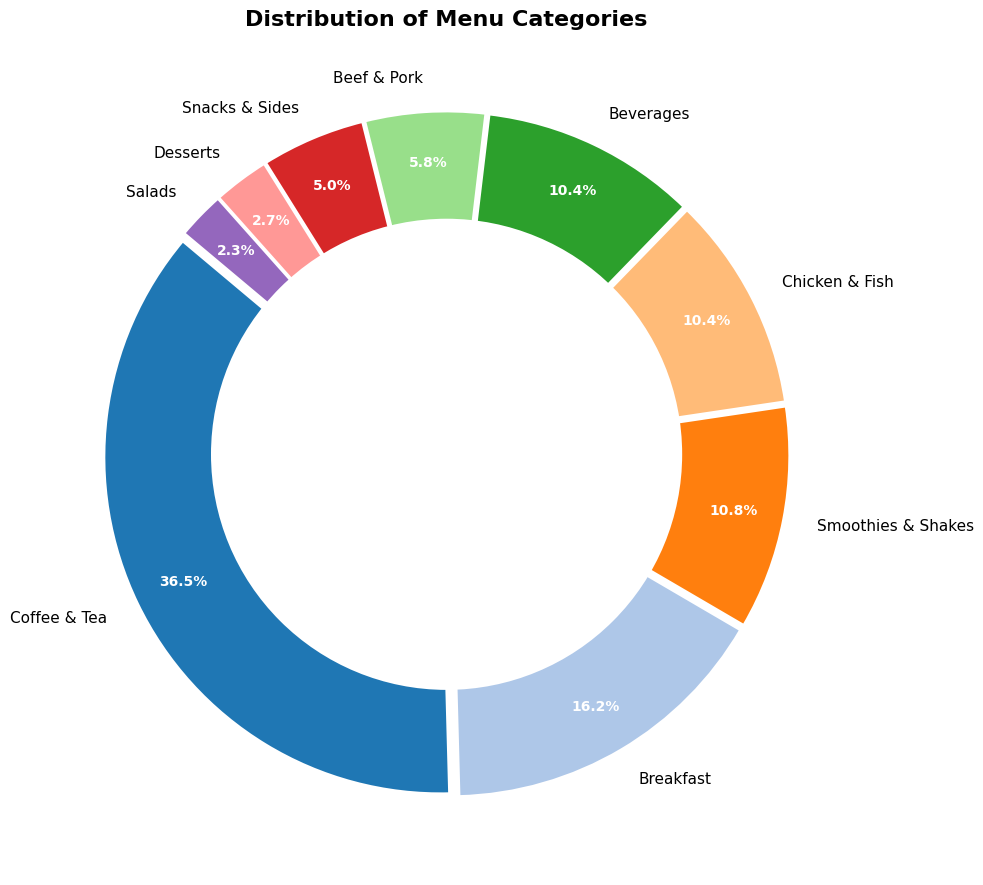
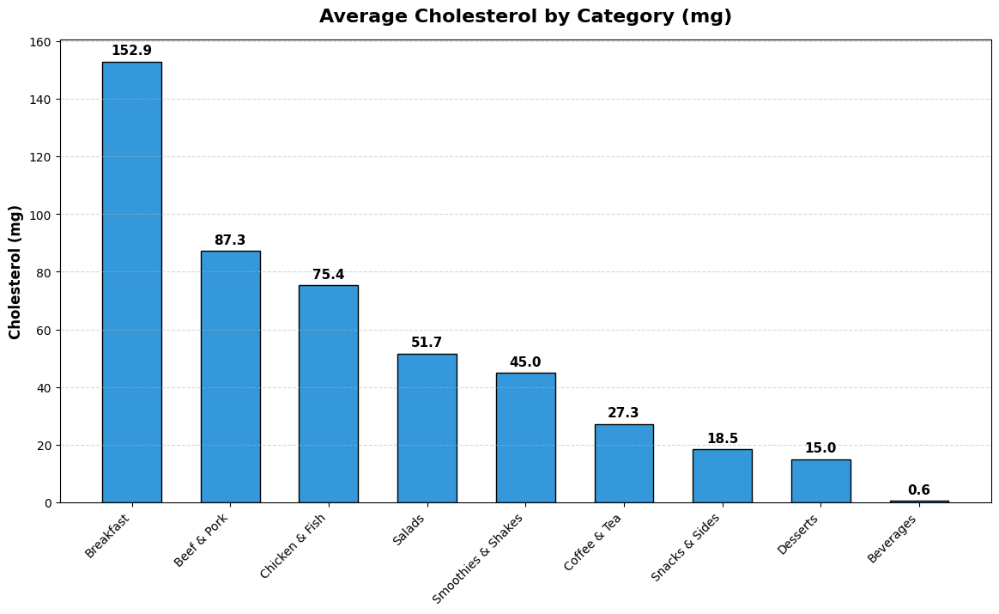
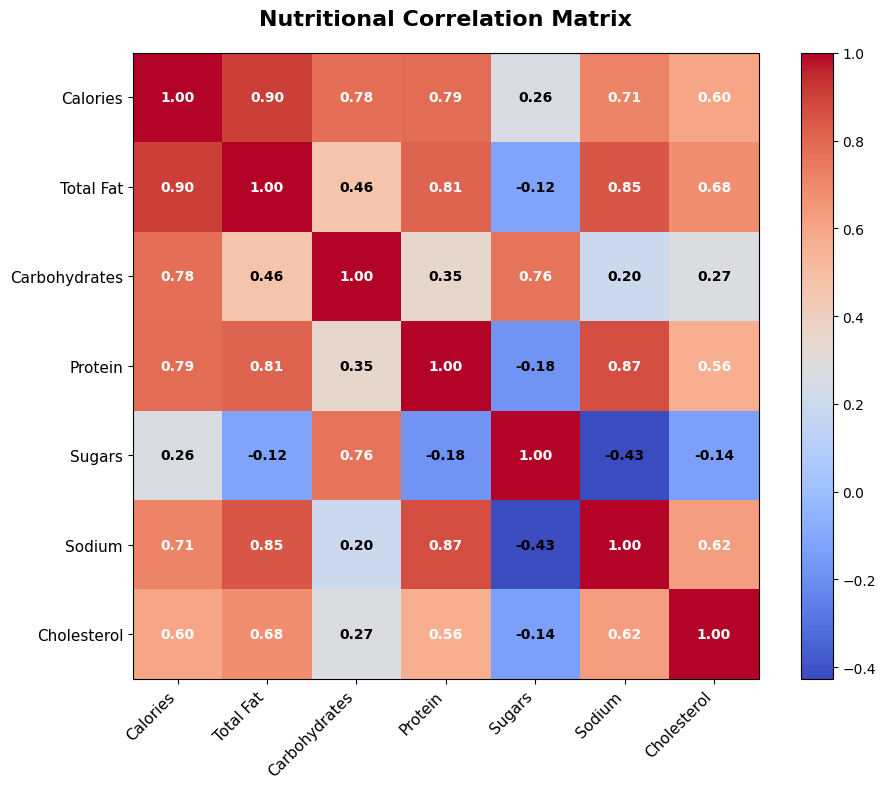

# 🍔 McDonald's Nutrition Analysis (EDA)


<div align="center">
  
  <br>
  <i>An Exploratory Data Analysis project to uncover the nutritional facts of the famous fast-food chain.</i>
</div>

---

## 📖 Overview
With the rising awareness of diet and health, understanding what we eat is crucial. This project performs an **Exploratory Data Analysis (EDA)** on McDonald's menu dataset. 

The goal is not just to visualize data but to answer critical questions about **Calories, Cholesterol, and Nutritional density** to help consumers make better dietary choices.

## 🎯 Key Objectives
- **Identify Caloric Outliers:** Which items are the "calorie bombs"?
- **Category Analysis:** How is the menu structured? (Beverages vs. Food).
- **Nutritional Deep Dive:** Analyzing Cholesterol, Fat, and Sugar content across categories.
- **Correlation Analysis:** Understanding the relationship between different nutrients (e.g., Fat vs. Calories).

## 🛠️ Tech Stack
- **Language:** Python
- **Data Manipulation:** Pandas, NumPy
- **Visualization:** Matplotlib
- **Environment:** Jupyter Notebook / VS Code

---

## 📊 Key Insights & Visualizations

### 1. The "Calorie Bomb" Alert 🚨
We filtered items containing **over 800 calories**. Surprisingly, the **Chicken McNuggets (40 piece)** tops the chart with 1,880 kcal, followed closely by various **Big Breakfast** platters.

**

### 2. Menu Structure
McDonald's is heavily focused on the morning commuter and beverage market, with **Coffee & Tea** and **Breakfast** making up over 50% of the entire menu.

**

### 3. Cholesterol Analysis
Contrary to popular belief that burgers are the worst offenders, the **Breakfast** category actually holds the highest average cholesterol levels due to the prevalence of eggs and sausages.

**

### 4. Nutritional Correlation Matrix
To understand the hidden drivers of calories, we used a Heatmap to visualize the correlation between nutrients. 

The analysis reveals a **very strong correlation (0.90)** between **Total Fat** and **Calories**, confirming that fat is the main contributor to caloric density. Interestingly, **Sugars** show almost zero correlation with Fat or Protein, indicating that "low-fat" items (like smoothies) can still be dangerously high in sugar.

**

---

## 📝 Conclusion
1.  **Extreme Caloric Density:** Certain "Value Meals" and large servings (Nuggets) exceed the daily caloric recommendation for an average adult.
2.  **Hidden Sugars:** While Beverages have low cholesterol, they (along with Desserts) are the primary source of sugar.
3.  **Dietary Recommendation:** For a heart-healthy option, **Chicken & Fish** items generally offer a better protein-to-fat ratio compared to the Breakfast category.
4.  **Nutrient Correlation:** Our heatmap analysis reveals that **Total Fat** is the biggest driver of Calories (correlation > 0.9). Interestingly, **Sugar** content is independent of Fat and Protein, meaning a "low-fat" item (like a smoothie) can still be dangerously high in sugar.

## 🚀 How to Run
1. Clone this repository:
   ```bash
   git clone git clone https://github.com/Mike-Nguyen602/mcdonalds-nutrition-eda.git